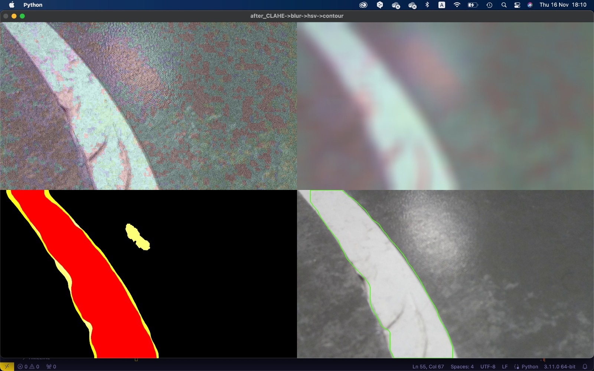
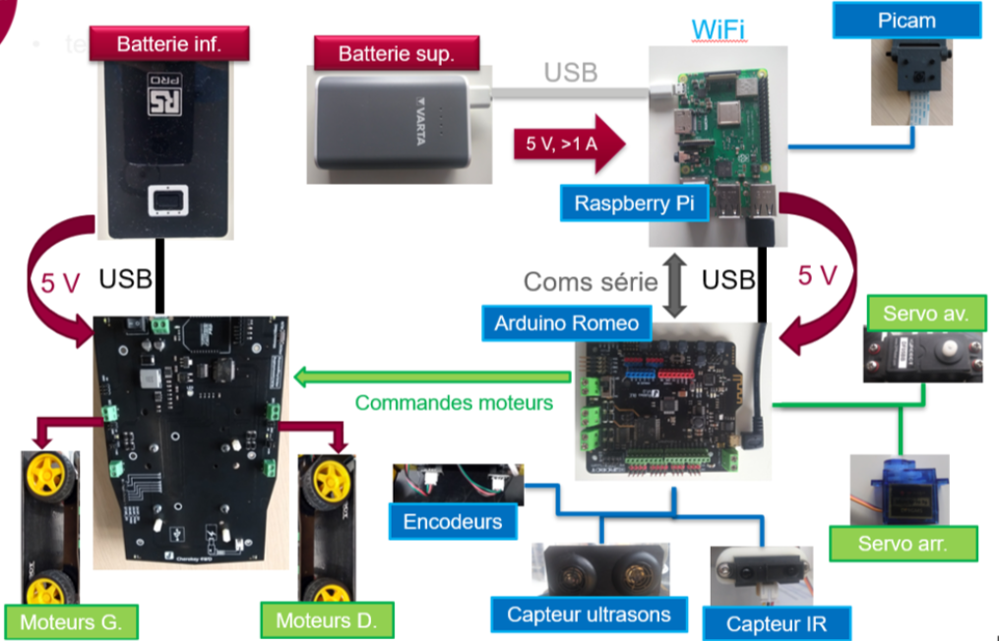

# Autonomous Delivery Robot for Urban Last-Mile Delivery

## Project Description

This project focuses on the development and testing of key functionalities for an autonomous robot designed to perform "last-mile" deliveries in urban environments. The robot operates with a high degree of autonomy, leveraging wireless communication to connect to a central system. This allows real-time data exchange, enabling efficient coordination and control.

The project incorporates advanced concepts in telecommunications, data processing, and system engineering, making it highly relevant to fields such as Telecommunications Engineering, Data Science, and Information Engineering.



### Key Objectives and Challenges

1. **Obstacle Detection and Avoidance**
    - **Identify static and dynamic obstacles using sensors**
    - **Implement real-time path planning to avoid collisions**
    - **Integrate machine learning algorithms for obstacle detection**
    - **Collaborate with other robots via wireless networks to avoid interferences**

2. **Line Tracking and Trajectory Control**
    - **Use computer vision algorithms for line detection and tracking**
    - **Maintain real-time trajectory correction using feedback loops**
    - **Develop a robust solution that adapts to varying lighting conditions**

3. **Autonomous Control Systems**
    - **Longitudinal (speed) and lateral (direction) control algorithms**
    - **Optimize control loops for stability and energy efficiency**

4. **Hardware and Software Integration**
    - **Seamless integration of Arduino and Raspberry Pi for sensor management and decision making**
    - **Real-time data processing with limited hardware resources**
    - **Synchronization of sensor inputs and control outputs for smooth operation**

5. **Energy and Performance Optimization**
    - **Improve energy efficiency to extend battery life**
    - **Balance speed and performance for timely and reliable deliveries**

6. **Localization and Navigation**
    - **Implement localization techniques for environment awareness**
    - **Utilize GPS, Wi-Fi triangulation, or sensor fusion for real-time positioning**

### Telecommunications and Data Science Relevance

- **Wireless Communication**: The robot communicates wirelessly with a central system, exchanging critical data for coordination and operational control, a core aspect of telecommunications engineering.
- **Real-Time Data Processing**: Sensor data is processed in real-time using efficient algorithms that ensure timely decision making, applicable in data science and engineering fields.
- **Autonomous System Coordination**: By integrating advanced control systems and data analytics, this project addresses challenges commonly found in telecommunications and information systems.

### Authors 
This project was a collaborative effort developed by a team of students, this is my own repository for the project, the original repository is in another colleague account

Authors: Vitor Opsfelder Estanislau,
Guilherme Mertens,
Lucas Martins Fernandes,
Max Lee,
Qi Yang Er 
### Hardware Architecture

- **Arduino Romeo**: Serves as the primary control board for motor management and low-level control.
- **Raspberry Pi 3 B+**: Handles high-level processing, including computer vision and wireless communication.
- **Camera with Tiltable Mount**: Enables real-time visual data collection for navigation and obstacle detection.
- **Ultrasonic and Infrared Sensors**: Provide proximity and obstacle detection capabilities.
- **Servomotors**: Used for precise movement control.
- **Li-Ion Battery or Ni-MH Accumulators**: Powers the motors and other hardware components.



### Project Structure

- `src/` - Contains the core source code
  - `Control/` - Control algorithms for movement and direction
  - `Decision/` - Decision-making modules for navigation and task execution
  - `Perception/` - Sensor data processing and interpretation
  - `robust_serial/` - Serial communication utilities for hardware integration
  - `arduino/` - Arduino sketches for low-level control
- `tests/` - Scripts for testing individual modules
- `.env.example` - Example environment variable configuration
- `.gitignore` - Git ignore file for version control
- `setup.py` - Installation script for the project package
- `README.md` - Project documentation

### Installation

1. Clone the repository:
    ```bash
    git clone https://github.com/yourusername/autonomous_delivery_robot.git
    cd autonomous_delivery_robot
    ```

2. Set up and activate a virtual environment:
    ```bash
    python -m venv venv
    source venv/bin/activate  # On Windows, use `venv\Scripts\activate`
    ```

3. Install the required packages:
    ```bash
    pip install -e .
    ```

### Usage

Run the main script:
```bash
python -m src.main
